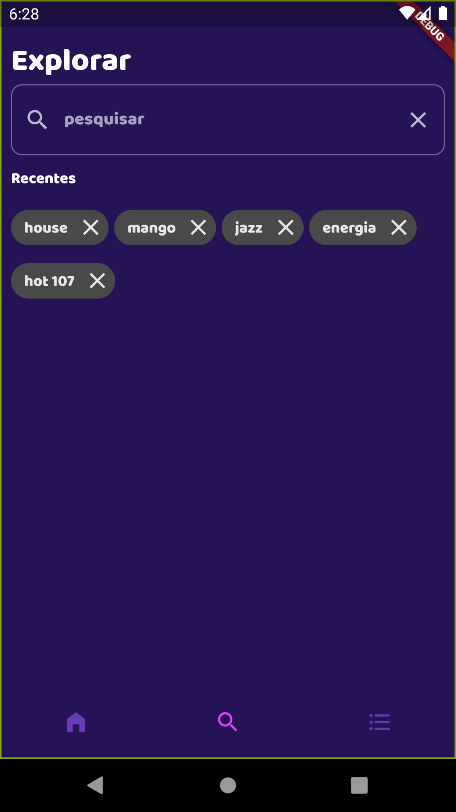
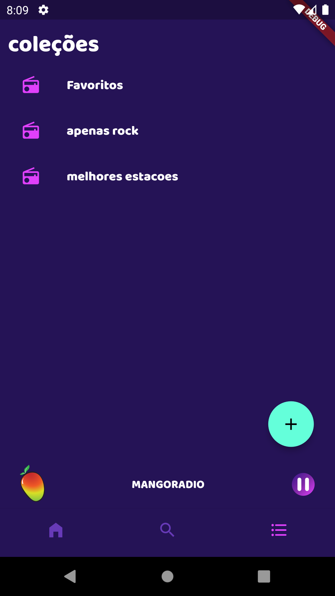
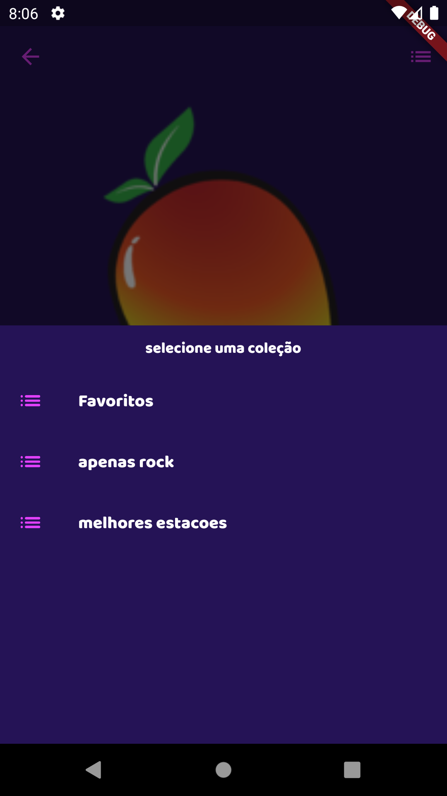
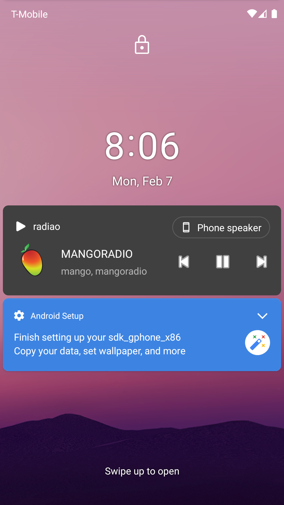

# tune_radio

tune_radio is a radio explorer app that lets you listen to several stations of various countries.

## features

- [X] trending stations
- [X] popular stations
- [X] listening now: a list of stations that other users are listening to
- [X] explorer page: search stations by name or tag and see recent stations you've listened to
- [X] collections: create your own collection and add stations on it
- [X] favorite: mark your favorite stations to listen to later

## screenshots

      

# TODO

- [ ] Utilizar pesquisa avançada (combinando parametros)
- [ ] Melhorar UI e temização
- [ ] Temas seguindo o padrao do celular (dark/light)
